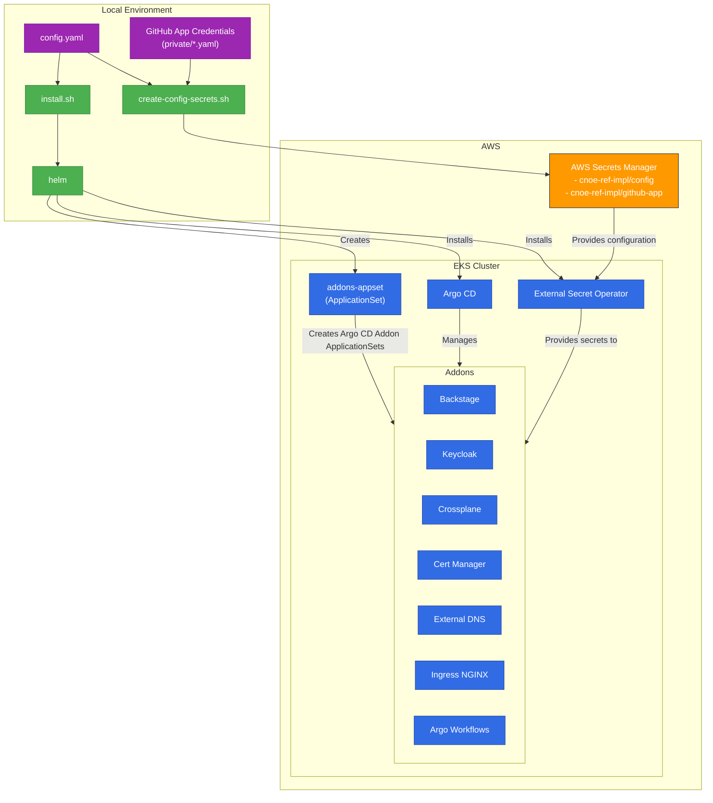

# AWS Reference Implementation

[🇰🇷 한국어](#한국어) | [🇺🇸 English](#english)

---

## 한국어

### 🎯 프로젝트 개요

AWS용 Internal Developer Platform (IDP) 레퍼런스 구현입니다. 이 프로젝트는 프로덕션에서 바로 사용 가능한 모든 도구가 설정된 IDP를 EKS에 구축합니다. GitOps Bridge App of ApplicationSets 패턴을 사용하여 Argo CD 앱으로 애드온을 설치합니다.

> [!NOTE]
> 이 저장소의 애플리케이션들은 프로덕션 환경을 구축하기 위한 시작점입니다.

### 📚 문서

| 문서 종류 | 설명 | 링크 |
|----------|------|------|
| **완벽 설치 가이드** (권장) | 처음 사용자를 위한 상세 가이드 | [📖 설치_가이드.md](docs/설치_가이드.md) |
| **트러블슈팅** | 실제 경험 기반 문제 해결 | [🔧 트러블슈팅.md](docs/트러블슈팅.md) |
| **빠른 시작** | 경험자를 위한 빠른 가이드 | [⚡ INSTALLATION.md](INSTALLATION.md) |
| 전체 설정 가이드 | 상세 설정 및 옵션 | [📋 SETUP_GUIDE_KR.md](docs/SETUP_GUIDE_KR.md) |
| 빠른 체크리스트 | 5분 체크리스트 | [✅ QUICK_START_KR.md](docs/QUICK_START_KR.md) |

> **🎯 처음 시작하시나요?** [한글 완벽 설치 가이드](docs/설치_가이드.md)를 따라하시면 한 번에 성공적으로 설치할 수 있습니다.

### 🏗️ 아키텍처 개요


### 📦 포함된 애드온

Helm 차트로 구성되며, 정적 값은 `packages/<addon-name>/values.yaml`에, 동적 값은 Argo CD 클러스터 시크릿 레이블/어노테이션 기반으로 `packages/addons/values.yaml`에 설정됩니다.

| 이름 | 네임스페이스 | 용도 | 차트 버전 | 차트 |
| ---------- | ---------- | ---------- | ---------- | ---------- |
| Argo CD | argocd | 애드온 Argo CD 애플리케이션 설치 및 관리 | 8.0.14 | [Link](https://github.com/argoproj/argo-helm/tree/main/charts/argo-cd) |
| Argo Workflows | argo | 지속적 통합 작업을 위한 워크플로우 도구 | 0.45.18 | [Link](https://github.com/argoproj/argo-helm/tree/main/charts/argo-workflows) |
| Backstage | backstage | 개발자 포털 (셀프서비스 웹 UI) | 2.6.0 | [Link](https://github.com/backstage/charts/tree/main/charts/backstage) |
| Cert Manager | cert-manager | Let's Encrypt를 사용한 인증서 관리 | 1.17.2 | [Link](https://cert-manager.io/docs/installation/helm/) |
| Crossplane | crossplane-system | 인프라 프로비저닝을 위한 IaC 컨트롤러 | 1.20.0 | [Link](https://github.com/crossplane/crossplane/tree/main/cluster/charts/crossplane) |
| External DNS | external-dns | Route 53을 사용한 도메인 관리 | 1.16.1 | [Link](https://github.com/kubernetes-sigs/external-dns/tree/master/charts/external-dns) |
| External Secrets | external-secrets | AWS Secret Manager 및 Parameter Store를 사용한 시크릿 관리 | 0.17.0 | [Link](https://github.com/external-secrets/external-secrets/tree/main/deploy/charts/external-secrets) |
| Ingress NGINX | ingress-nginx | L7 네트워크 트래픽 라우팅을 위한 Ingress 컨트롤러 | 4.7.0 | [Link](https://github.com/kubernetes/ingress-nginx/tree/main/charts/ingress-nginx) |
| Keycloak | keycloak | 사용자 인증을 위한 Identity Provider | 24.7.3 | [Link](https://github.com/bitnami/charts/tree/main/bitnami/keycloak) |

설치 흐름에 대한 자세한 내용은 [installation flow](docs/installation_flow.md)를 확인하세요.

### 🚀 빠른 시작

#### 사전 요구사항
- AWS 계정 및 IAM 자격 증명
- GitHub Organization
- Route53 Hosted Zone
- 로컬 도구: AWS CLI, kubectl, eksctl, helm, yq

#### 설치 단계

1. **Repository Fork**
   ```bash
   gh repo fork cnoe-io/reference-implementation-aws --clone=true
   cd reference-implementation-aws
   ```

2. **GitHub Apps 생성**
   - Backstage용 GitHub App
   - Argo CD용 GitHub App
   - 자격 증명을 `private/*.yaml`에 저장

3. **설정 파일 작성**
   ```bash
   # config.yaml 편집
   vi config.yaml

   # AWS Secrets Manager에 저장
   ./scripts/create-config-secrets.sh
   ```

4. **EKS 클러스터 생성**
   ```bash
   ./scripts/create-cluster.sh
   ```

5. **플랫폼 설치**
   ```bash
   ./scripts/install.sh
   ```

6. **접속**
   - Backstage: `https://your-domain.com`
   - Argo CD: `https://your-domain.com/argocd`
   - Argo Workflows: `https://your-domain.com/argo-workflows`

> **상세 가이드**: [완벽 설치 가이드](docs/설치_가이드.md)를 참고하세요.

### 🆘 문제 해결

문제가 발생하면 [트러블슈팅 가이드](docs/트러블슈팅.md)를 확인하세요.

자주 발생하는 문제:
- ✅ Backstage `webhookSecret` CrashLoopBackOff
- ✅ ClusterSecretStore 리전 불일치
- ✅ Keycloak/PostgreSQL 이미지 문제 (bitnami → bitnamilegacy)
- ✅ Certificate 발급 실패
- ✅ DNS 전파 문제

### 🧹 정리

```bash
# 애드온 제거
./scripts/uninstall.sh

# CRDs 제거
./scripts/cleanup-crds.sh

# EKS 클러스터 삭제
eksctl delete cluster --name YOUR-CLUSTER-NAME --region YOUR-REGION
```

---

## English

### 🎯 Project Overview

This project contains an Internal Developer Platform (IDP) reference implementation for AWS. This project can bring up an IDP on EKS with all the tools configured and ready to use in production. It will install addons on an EKS cluster as Argo CD apps using GitOps Bridge App of ApplicationSets pattern.

> [!NOTE]
> Applications deployed in this repository are a starting point to get environment into production.

### 📚 Documentation

| Language | Guide Type | Link |
|----------|-----------|------|
| 🇰🇷 Korean | **Complete Installation Guide** (Recommended) | [설치_가이드.md](docs/설치_가이드.md) |
| 🇰🇷 Korean | Troubleshooting | [트러블슈팅.md](docs/트러블슈팅.md) |
| 🇰🇷 Korean | Quick Start | [INSTALLATION.md](INSTALLATION.md) |
| 🇺🇸 English | Full Guide | [Getting Started](#getting-started-english) |

> **🎯 New Users**: Follow the [Complete Installation Guide](docs/설치_가이드.md) for a successful first-time installation.

### 🏗️ Architecture Overview


### 📦 Addons

All the addons are helm charts with static values configured in `packages/<addon-name>/values.yaml` and dynamic values based on Argo CD cluster secret label/annotations values in `packages/addons/values.yaml`.

| Name | Namespace | Purpose | Chart Version | Chart |
| ---------- | ---------- | ---------- | ---------- | ---------- |
| Argo CD | argocd | Installation and management of addon Argo CD application | 8.0.14 | [Link](https://github.com/argoproj/argo-helm/tree/main/charts/argo-cd) |
| Argo Workflows | argo | Workflow tool for continuous integration tasks  | 0.45.18 | [Link](https://github.com/argoproj/argo-helm/tree/main/charts/argo-workflows) |
| Backstage | backstage | Self-Service Web UI (Developer Portal) for developers | 2.6.0 | [Link](https://github.com/backstage/charts/tree/main/charts/backstage) |
| Cert Manager | cert-manager | Certificate manager for addons and developer applications using Let's Encrypt | 1.17.2 | [Link](https://cert-manager.io/docs/installation/helm/) |
| Crossplane | crossplane-system | IaC controller for provisioning infrastructure  | 1.20.0 | [Link](https://github.com/crossplane/crossplane/tree/main/cluster/charts/crossplane) |
| ACK | ack-system | IaC controller for provisioning infrastructure  | TBD | Coming soon check [#54](https://github.com/cnoe-io/reference-implementation-aws/issues/54) |
| External DNS | external-dns | Domain management using Route 53 | 1.16.1 | [Link](https://github.com/kubernetes-sigs/external-dns/tree/master/charts/external-dns) |
| External Secrets | external-secrets | Secret Management using AWS Secret Manager and AWS Systems Manager Parameter Store | 0.17.0 | [Link](https://github.com/external-secrets/external-secrets/tree/main/deploy/charts/external-secrets) |
| Ingress NGINX | ingress-nginx | Ingress controller for L7 network traffic routing  | 4.7.0 | [Link](https://github.com/kubernetes/ingress-nginx/tree/main/charts/ingress-nginx) |
| Keycloak | keycloak | Identity provider for User Authentication | 24.7.3 | [Link](https://github.com/bitnami/charts/tree/main/bitnami/keycloak) |

Check out more details about the [installation flow](docs/installation_flow.md).

### 📊 Installation Flow Diagram
This diagram illustrates the high-level installation flow for the CNOE AWS Reference Implementation. It shows how the local environment interacts with AWS resources to deploy and configure the platform on an EKS cluster.



## Getting Started (English)

### Step 1. ⚙️ Prepare Environment for Installation

#### 📦 Install Binaries

The installation requires the following binaries in the local environment:

+ [**AWS CLI**](https://docs.aws.amazon.com/cli/latest/userguide/getting-started-install.html)
+ [**kubectl**](https://kubernetes.io/docs/tasks/tools/)
+ [**yq**](https://mikefarah.gitbook.io/yq/v3.x)
+ [**helm**](https://helm.sh/docs/intro/install/)

#### 🔐 Configure AWS Credentials
Configure the AWS CLI with credentials of an IAM role which has access to the EKS cluster. Follow the instructions in the [AWS documentation](https://docs.aws.amazon.com/cli/latest/userguide/getting-started-quickstart.html#getting-started-quickstart-new) to configure the AWS CLI.

If the installation steps are being executed on an EC2 instance, ensure that the EC2 IAM instance role has permissions to access the EKS cluster or the AWS CLI is configured as mentioned above.


### Step 2. 🏢 Create GitHub Organization

Backstage and Argo CD in this reference implementation are integrated with GitHub. Both Backstage and ArgoCD use Github Apps for authenticating with Github.

Therefore, a GitHub Organization should be created in order to create GitHub Apps for these integrations. Follow the instructions in [GitHub documentation](https://docs.github.com/en/organizations/collaborating-with-groups-in-organizations/creating-a-new-organization-from-scratch) to create new organization or visit [here](https://github.com/account/organizations/new).

> [!NOTE]
> It is recommended to use a Github Organization instead of a personal github ID as Backstage has certain [limitations](https://backstage.io/docs/integrations/github/github-apps/#caveats) for using personal account Github Apps for authenticating to Github. Also, the Github Organization is ***FREE***.

### Step 3. 🍴 Fork the Repository

Once the organization is created, fork this repository to the new GitHub Organization by following instructions in [GitHub documentation](https://docs.github.com/en/pull-requests/collaborating-with-pull-requests/working-with-forks/fork-a-repo).

### Step 4. 💻 Create GitHub Apps

There are two ways to create a GitHub App. You can use the Backstage CLI `npx @backstage/cli create-github-app <github-org>` as per instructions in the [Backstage documentation](https://backstage.io/docs/integrations/github/github-apps/#using-the-cli-public-github-only), or create it manually per these instructions in the [GitHub documentation](https://backstage.io/docs/integrations/github/github-apps).

Create the following apps and store them in the corresponding file path.

| App Name | Purpose | Required Permissions | File Path | Expected Content |
| -------- | ------- | -------------------- | --------- | ---------------- |
| Backstage | Used for automatically importing Backstage configuration such as Organization information, templates and creating new repositories for developer applications. | For All Repositories - Read access to members, metadata, and organization administration - Read and write access to administration and code | **`private/backstage-github.yaml`** |  |
| Argo CD | Used for deploying resources to cluster specified by Argo CD applications.| For All Repositories - Read access to checks, code, members, and metadata| **`private/argocd-github.yaml`** |  |

The template files for both these Github Apps are available in `private` directory. Copy these template files to above mentioned file path by running following command:

```
cp private/argocd-github.yaml.template private/argocd-github.yaml
cp private/backstage-github.yaml.template private/backstage-github.yaml
```

After this, update the values in these files by getting them from files created by `backstage-cli` _(if used)_ or get the values from Github page of App Overview.

Argo CD requires `url` and `installationId` of the GitHub app. The `url` is the GitHub URL of the organization. The `installationId` can be captured by navigating to the app installation page with URL `https://github.com/organizations/<Organization-name>/settings/installations/<ID>`. You can find more information [on this page](https://stackoverflow.com/questions/74462420/where-can-we-find-github-apps-installation-id).

> [!WARNING]
> **If the app is created using the Backstage CLI, it creates files in the current working directory. These files contain credentials. Handle them with care. It is recommended to remove these files after copying the content over to files in the `private` directory**

> [!NOTE]
> The rest of the installation process assumes the GitHub apps credentials are available in `private/backstage-github.yaml` and `private/argocd-github.yaml`

#### Step 5. ⚙️ Configure Reference Implementation

The reference implementation uses [config.yaml](config.yaml) file in the repository root directory to configure the installation values. The **`config.yaml`** should be updated with appropriate values before proceeding. Refer to the following table and update all the values appropriately. All the values are required.

| Parameter | Description | Type |
|-----------|-------------|------|
| `cluster_name` | Name of the EKS cluster for reference implementation   **(The name should satisfy criteria of a valid [kubernetes resource name](https://kubernetes.io/docs/concepts/overview/working-with-objects/names/))** | string |
| `auto_mode` | Set to "true" if EKS cluster is Auto Mode, otherwise "false" | string |
| `repo.url` | GitHub URL of the fork in the Github Org | string |
| `repo.revision` | Branch or tag which should be used for Argo CD Apps | string |
| `repo.basepath` | Directory in which the configuration of addons is stored | string |
| `region` | AWS Region of the EKS cluster and config secret | string |
| `domain` | Base Domain name for exposing services **(This should be base domain or sub domain of the Route53 Hosted Zone)** | string |
| `route53_hosted_zone_id` | Route53 hosted zone ID for configuring external-dns | string |
| `path_routing` | Enable path routing ("true") vs domain-based routing ("false") | string |
| `tags` | Arbitrary key-value pairs for AWS resource tagging | object |

> [!TIP]
> If these values are updated after installation, ensure to run the command in the next step to update the values in AWS Secret Manager. Otherwise, the updated values will not reflect in the live installation.


#### Step 6. 🔒 Create Secrets in AWS Secret Manager

The values required for the installation are stored in AWS Secret Manager in two secrets:

1. **cnoe-ref-impl/config:** Stores values from **`config.yaml`** in JSON
2. **cnoe-ref-impl/github-app:** Stores GitHub App credentials with file name as key and content of the file as value from **private** directory.

Run the command below to create new secrets or update the existing secrets if they already exist.

```bash
./scripts/create-config-secrets.sh
```

> [!WARNING]
> **DO NOT** move to next steps without completing all the instructions in this step

### Step 7. ☸️ Create EKS Cluster

The reference implementation can be installed on a new EKS cluster which can be created like this:

```bash
export REPO_ROOT=$(git rev-parse --show-toplevel)
$REPO_ROOT/scripts/create-cluster.sh
```
You will be prompted to select `eksctl` or `terraform`

For more details on each type of tools check the corresponding guides:
+ **eksctl**: Follow the [instructions](cluster/eksctl)
+ **terraform**: Follow the [instructions](cluster/terraform/)

This will create all the prerequisite AWS Resources required for the reference implementation, which includes:

+ EKS cluster with Auto Mode or Without Auto Mode (Managed Node Group with 4 nodes)
+ Pod Identity Associations for following Addons:

| Name | Namespace | Service Account Name | Permissions |
| ----- | --------- | -------------------- | ---------- |
| Crossplane | crossplane-system | provider-aws | Admin Permissions but with [permission boundary](cluster/iam-policies/crossplane-permissions-boundry.json) |
| External Secrets | external-secrets | external-secrets | [Permissions](https://external-secrets.io/latest/provider/aws-secrets-manager/#iam-policy) |
| External DNS | external-dns | external-dns | [Permissions](https://kubernetes-sigs.github.io/external-dns/latest/docs/tutorials/aws/#iam-policy) |
| AWS Load Balancer Controller (When not using Auto Mode) | kube-system | aws-load-balancer-controller | [Permissions](https://github.com/kubernetes-sigs/aws-load-balancer-controller/blob/main/docs/install/iam_policy.json) |
| AWS EBS CSI Controller (When not using Auto Mode) | kube-system | ebs-csi-controller-sa | [Permissions](https://docs.aws.amazon.com/aws-managed-policy/latest/reference/AmazonEBSCSIDriverPolicy.html) |

> [!NOTE]
> **Using Existing EKS Cluster**
>
> The reference implementation can be installed on an existing EKS Cluster only if the above prerequisites are completed.


### Step 8. 🚀 Deployment
> [!NOTE]
> Before moving forward, ensure that the kubectl context is set to the EKS cluster and the configured AWS IAM role has access to the cluster.

#### ▶️ Start the Installation Process

All the addons are installed as Argo CD apps. At the start of the installation, Argo CD and External Secret Operator are installed on the EKS cluster as a helm chart. Once Argo CD on EKS is up, other addons are installed through it and finally the Argo CD on EKS also manages itself and External Secret Operator. Check out more details about the [installation flow](docs/installation_flow.md). Run the following command to start the installation.

```bash
scripts/install.sh
```

### Step 9. 🌐 Accessing the Platform

The addons with Web UI are exposed using the base domain configured in [Step 5](#️-configure-reference-implementation). The URLs can be retrieved by running the following command:
```bash
scripts/get-urls.sh
```
The URL depends on the setting for `path_routing`. Refer to following table for URLs:

| App Name | URL (w/ Path Routing) | URL (w/o Path Routing) |
| --------- | --------- | --------- |
| Backstage | `https://[domain]` | `https://backstage.[domain]` |
| Argo CD | `https://[domain]/argocd` | `https://argocd.[domain]` |
| Argo Workflows | `https://[domain]/argo-workflows` | `https://argo-workflows.[domain]` |


#### 📊 Monitor Deployment Process

The installation script will continue to run until all the Argo CD apps for addons are healthy. To monitor the process, use the instructions below to access the instance of Argo CD running on EKS.

Check if the kubectl context is set to the EKS cluster and it can access the EKS cluster.

You can use `kubectl` to check the status of the Argo CD applications

```bash
kubectl get applications -n argocd --watch
```

Get the credentials for Argo CD and start a port-forward with this command:

```bash
kubectl get secrets -n argocd argocd-initial-admin-secret -oyaml | yq '.data.password' | base64 -d && echo
kubectl port-forward -n argocd svc/argocd-server 8080:80
```

Depending upon the configuration, Argo CD will be accessible at http://localhost:8080 or http://localhost:8080/argocd.

All the addons are configured with Keycloak SSO `user1` and the user password for it can be retrieved using the following command:

```bash
kubectl get secret -n keycloak keycloak-config -o jsonpath='{.data.USER1_PASSWORD}' | base64 -d && echo
```

Once all the Argo CD apps on the EKS cluster are reporting healthy status, try out the [examples](examples/) to create a new application through Backstage.

For troubleshooting, refer to the [troubleshooting guide](docs/트러블슈팅.md).

### 🆘 Troubleshooting

Common issues and solutions:
- ✅ Backstage `webhookSecret` CrashLoopBackOff
- ✅ ClusterSecretStore region mismatch
- ✅ Keycloak/PostgreSQL image issues (bitnami → bitnamilegacy)
- ✅ Certificate issuance failures
- ✅ DNS propagation issues

See the full [troubleshooting guide](docs/트러블슈팅.md) for detailed solutions.

## Cleanup
> [!WARNING]
> Before proceeding with the cleanup, ensure any Kubernetes resources created outside of the installation process such as Argo CD Apps, deployments, volumes etc. are deleted.

Run the following command to remove all the addons created by this installation:

```bash
scripts/uninstall.sh
```

This script will only remove resources other than CRDs from the EKS cluster so that the same cluster can be used for re-installation which is useful during development. To remove CRDs, use the following command:

```bash
scripts/cleanup-crds.sh
```
