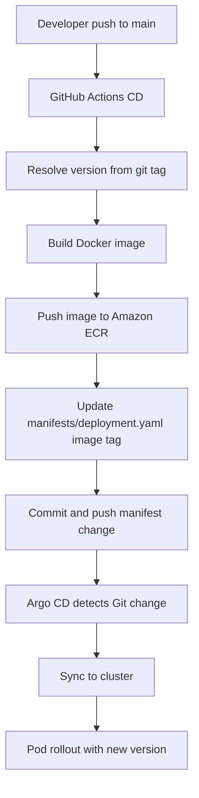

# Backstage 템플릿 CD 가이드 (Java/Node 공통)

## 1. 문서 목적

이 문서는 Backstage 템플릿으로 생성된 Java/Node 저장소에서 `main` 브랜치 push 시 자동으로 배포까지 이어지는 CD 동작을 설명합니다.

- 이미지 빌드
- Amazon ECR push
- `manifests/deployment.yaml` 이미지 태그 업데이트
- Git commit/push (GitOps 반영)
- Argo CD 자동 동기화로 클러스터 반영

---

## 2. 적용된 워크플로우 파일

Node.js 템플릿:
- `templates/backstage/nodejs-nginx/skeleton-base/.github/workflows/ci.yaml`
- `templates/backstage/nodejs-nginx/skeleton-base/.github/workflows/cd.yaml`

Spring Boot 템플릿:
- `templates/backstage/springboot-apache/skeleton-base/.github/workflows/ci.yaml`
- `templates/backstage/springboot-apache/skeleton-base/.github/workflows/cd.yaml`

추가 파일:
- `templates/backstage/springboot-apache/skeleton-base/Dockerfile`

---

## 3. CI/CD 분리 구조

CI (`ci.yaml`):
- PR, main push에서 빌드/테스트 수행

CD (`cd.yaml`):
- `main` push에서만 실행
- ECR 이미지 빌드/푸시
- `manifests/deployment.yaml`의 `image:`를 새 버전 태그로 갱신
- 해당 변경 커밋/푸시 (`chore(cd): update image tag [skip ci]`)

참고:
- `cd.yaml`에는 `if: github.actor != 'github-actions[bot]'` 조건이 있어 bot 커밋 루프를 방지합니다.

---

## 4. CD 동작 흐름

1. 개발자가 `main` 브랜치에 코드 push
2. GitHub Actions `CD` 워크플로우 실행
3. Git 태그 기반 버전 계산 (`git describe --tags --always --dirty=-dev`)
4. Docker 이미지 빌드 후 ECR에 push
5. `manifests/deployment.yaml`의 `image` 값을 새 태그로 수정
6. 변경된 매니페스트를 `main`에 commit/push
7. Argo CD가 Git 변경 감지 후 동기화
8. Kubernetes Pod가 새 이미지 버전으로 롤링 업데이트

---

## 5. 흐름도

---

## 6. 필수 GitHub Secrets

각 생성 저장소에 아래 값이 있어야 CD가 성공합니다.

- `AWS_ROLE_ARN`
- `AWS_REGION`

설명:
- `AWS_ROLE_ARN`: GitHub OIDC로 AssumeRole 할 AWS IAM Role ARN
- `AWS_REGION`: ECR 리전 (예: `ap-northeast-2`)

---

## 7. 권장 운영 방식 (중요)

권장: **GitHub Organization 레벨 Actions Secrets로 공통 관리**

이유:
- repo마다 수동 등록하는 작업 감소
- 신규 템플릿 repo 생성 시 즉시 재사용 가능
- 오타/누락으로 인한 CD 실패 감소
- 운영 정책을 중앙에서 관리 가능

권장 설정:
1. GitHub Organization -> `Settings` -> `Secrets and variables` -> `Actions`
2. Organization Secrets에 `AWS_ROLE_ARN`, `AWS_REGION` 생성
3. 접근 대상 Repository 범위를 제한(전체 또는 특정 repo)

---

## 8. 운영 체크리스트

1. 생성된 repo에 `cd.yaml`이 포함되어 있는지 확인
2. Secrets(`AWS_ROLE_ARN`, `AWS_REGION`)이 유효한지 확인
3. IAM Role의 OIDC Trust 정책이 GitHub repo를 허용하는지 확인
4. ECR 리포지토리 생성/푸시 권한이 Role에 포함되어 있는지 확인
5. Argo CD Application이 Auto Sync 상태인지 확인

