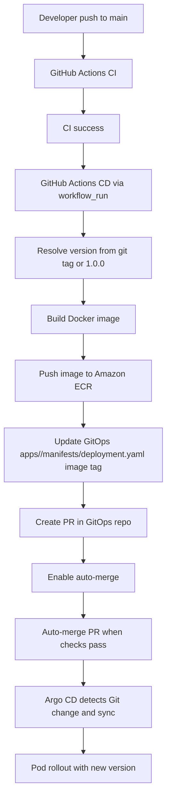

# Backstage 템플릿 CD 가이드 (Java/Node 공통)

## 1. 문서 목적

이 문서는 Backstage 템플릿으로 생성된 Java/Node 저장소에서 `main` 브랜치 push 시 자동으로 배포까지 이어지는 CD 동작을 설명합니다.

- 이미지 빌드
- Amazon ECR push
- `manifests/deployment.yaml` 이미지 태그 업데이트
- Git commit/push (GitOps 반영)
- Argo CD 자동 동기화로 클러스터 반영

적용 기준:
- `reference-implementation-aws` `main` (`36e264d` 이후)
- CD는 CI 성공 완료(`workflow_run`) 이후에만 실행

---

## 2. 적용된 워크플로우 파일

Node.js 템플릿:
- `templates/backstage/nodejs-nginx/skeleton-base/.github/workflows/ci.yaml`
- `templates/backstage/nodejs-nginx/skeleton-base/.github/workflows/cd.yaml`

Spring Boot 템플릿:
- `templates/backstage/springboot-apache/skeleton-base/.github/workflows/ci.yaml`
- `templates/backstage/springboot-apache/skeleton-base/.github/workflows/cd.yaml`

추가 파일:
- `templates/backstage/springboot-apache/skeleton-base/Dockerfile`

---

## 3. CI/CD 분리 구조

CI (`ci.yaml`):
- PR, main push에서 빌드/테스트 수행

CD (`cd.yaml`):
- `workflow_run` 기반으로 CI 완료 후 실행
- `CI` 성공 + `main` 브랜치 조건에서만 실행
- ECR 이미지 빌드/푸시
- GitOps repo `apps/<app-name>/manifests/deployment.yaml`의 `image:`를 새 버전 태그로 갱신
- 보호 브랜치 환경을 고려해 GitOps repo에 PR 자동 생성
- 생성된 PR에 auto-merge를 설정(필수 체크 통과 시 자동 병합)

참고:
- Backstage 템플릿 렌더링 시 GitHub 표현식이 깨지지 않도록 `...`를 사용합니다.

---

## 4. CD 동작 흐름

1. 개발자가 `main` 브랜치에 코드 push
2. GitHub Actions `CI` 실행 및 성공
3. `workflow_run` 이벤트로 `CD` 실행
4. Git 태그 기반 버전 계산 (태그 없으면 `1.0.0`)
5. Docker 이미지 빌드 후 ECR에 push
6. GitOps repo `apps/<app-name>/manifests/deployment.yaml`의 `image` 값을 새 태그로 수정
7. 변경 매니페스트로 GitOps repo PR 자동 생성
8. PR auto-merge 대기(필수 체크 통과 시 자동 병합)
9. Argo CD가 Git 변경 감지, 클러스터 반영

---

## 5. 흐름도

---

## 6. 필수 GitHub Secrets/권한

각 생성 저장소에 아래 값이 있어야 CD가 성공합니다.

- `AWS_ROLE_ARN`
- `AWS_REGION`
- `GITOPS_REPO_TOKEN`

설명:
- `AWS_ROLE_ARN`: GitHub OIDC로 AssumeRole 할 AWS IAM Role ARN
- `AWS_REGION`: ECR 리전 (예: `ap-northeast-2`)
- `GITOPS_REPO_TOKEN`: GitOps repo에 PR 생성/auto-merge 가능한 토큰(App token 또는 PAT)

추가 필수 권한:
- Repo `Settings -> Actions -> General`
  - `Workflow permissions: Read and write permissions`
  - `Allow GitHub Actions to create and approve pull requests`
- GitOps 대상 repo `Settings -> General`
  - `Allow auto-merge` 활성화

권장:
- 민감정보가 아닌 `AWS_REGION`은 Organization Variables로 관리해도 무방
- 현재 템플릿은 Secret(`secrets.AWS_REGION`) 기반으로 작성되어 있으므로 동일 방식 유지 시 Secret에 등록

---

## 7. 권장 운영 방식 (중요)

권장: **GitHub Organization 레벨 Actions Secrets로 공통 관리**

이유:
- repo마다 수동 등록하는 작업 감소
- 신규 템플릿 repo 생성 시 즉시 재사용 가능
- 오타/누락으로 인한 CD 실패 감소
- 운영 정책을 중앙에서 관리 가능

권장 설정:
1. GitHub Organization -> `Settings` -> `Secrets and variables` -> `Actions`
2. Organization Secrets에 `AWS_ROLE_ARN`, `AWS_REGION` 생성
3. 접근 대상 Repository 범위를 제한(전체 또는 특정 repo)

추가 필수 설정:
1. `Organization Settings -> Actions -> General`
2. `Workflow permissions`: `Read and write permissions`
3. `Allow GitHub Actions to create and approve pull requests`: 활성화

참고:
- `Allow auto-merge`는 템플릿의 `github:repo:create`에서 자동 활성화되도록 구성됨

---

## 8. 운영 체크리스트

1. 생성된 repo에 `cd.yaml`이 포함되어 있는지 확인
2. Secrets(`AWS_ROLE_ARN`, `AWS_REGION`)이 유효한지 확인
3. IAM Role의 OIDC Trust 정책이 GitHub repo를 허용하는지 확인
4. IAM Role에 ECR 권한(`BatchGetImage`, `DescribeImages` 포함)이 있는지 확인
5. Organization/Repository Actions 권한에서 PR 생성이 허용되어 있는지 확인
6. 브랜치 보호 규칙(main) 하에서 CD PR 병합 프로세스가 운영되는지 확인
7. Argo CD Application이 Auto Sync 상태인지 확인

---

## 9. 완전 자동을 위한 설정 체크리스트

아래 항목은 Organization 또는 Repository 단위로 충족되어야 합니다.

1. `Organization Settings -> Actions -> General`
   - `Workflow permissions`: `Read and write permissions`
   - `Allow GitHub Actions to create and approve pull requests`: 활성화
2. Organization Secrets/Variables
   - `AWS_ROLE_ARN`, `AWS_REGION`을 org 단위로 등록하고 대상 repo에 접근 허용
3. GitOps repo 설정
   - `Allow auto-merge` 활성화
   - (Ruleset 사용 시) CD 토큰 주체의 bypass 권한 허용

템플릿이 자동 처리하는 항목:
- repo 생성 시 `allowAutoMerge=true` 적용
- CD에서 이미지 업데이트 PR 생성 후 auto-merge 자동 설정

---

## 10. 최신 업데이트 (2026-02-22)

### 10.1 Preflight 단계 추가

Node/Java 템플릿에서 생성되는 `cd.yaml`에 `preflight` job이 추가되었습니다.

- 실행 순서:
  1. `preflight`
  2. `publish-ecr` (`needs: preflight`)
- 검증 내용:
  - 필수 시크릿 존재: `AWS_REGION`, `AWS_ROLE_ARN`, `GITOPS_REPO_TOKEN`
  - GitOps repo 접근 가능 여부
  - `apps/<app-name>` 경로 상태 확인

### 10.2 앱 코드 repo에서 매니페스트 제거

- Node/Java 템플릿 생성 결과에서 `manifests/*`는 더 이상 포함되지 않습니다.
- 배포 선언은 GitOps repo `apps/<app-name>`로만 관리합니다.

### 10.3 템플릿 실행 순서 보강

- `catalog:register` 후 `create-argocd-app` 실행으로 조정
- catalog 중복 충돌 시 Argo CD 생성 전 중단하도록 변경

### 10.4 운영 체크 포인트 추가

신규 생성 프로젝트 확인 시 아래 순서를 권장합니다.

1. Backstage 템플릿 실행 성공(특히 `register` 단계)
2. 생성된 앱 repo의 `cd.yaml`에서 `preflight` 통과 확인
3. GitOps repo에 `apps/<app-name>` 생성/갱신 PR 확인
4. PR auto-merge 후 Argo CD 동기화 상태 확인

### 10.5 템플릿 실패 시 자동 정리(보상 삭제) 추가

- `cnoe:create-argocd-app` 백엔드 액션이 실패 시 cleanup을 수행하도록 확장
- 정리 대상(가능한 경우):
  1. Argo CD Application 삭제
  2. 생성된 GitHub Repository 삭제
  3. ECR Repository 삭제(`aws` CLI 사용 가능 시)
- Node/Java 템플릿에서 cleanup 파라미터를 함께 전달하도록 반영
- 참고:
  - GitHub 삭제는 Backstage의 GitHub integration token이 설정된 경우에만 수행됨
  - ECR 삭제는 실행 컨테이너의 AWS 권한/CLI 존재 여부에 따라 best-effort로 수행됨
